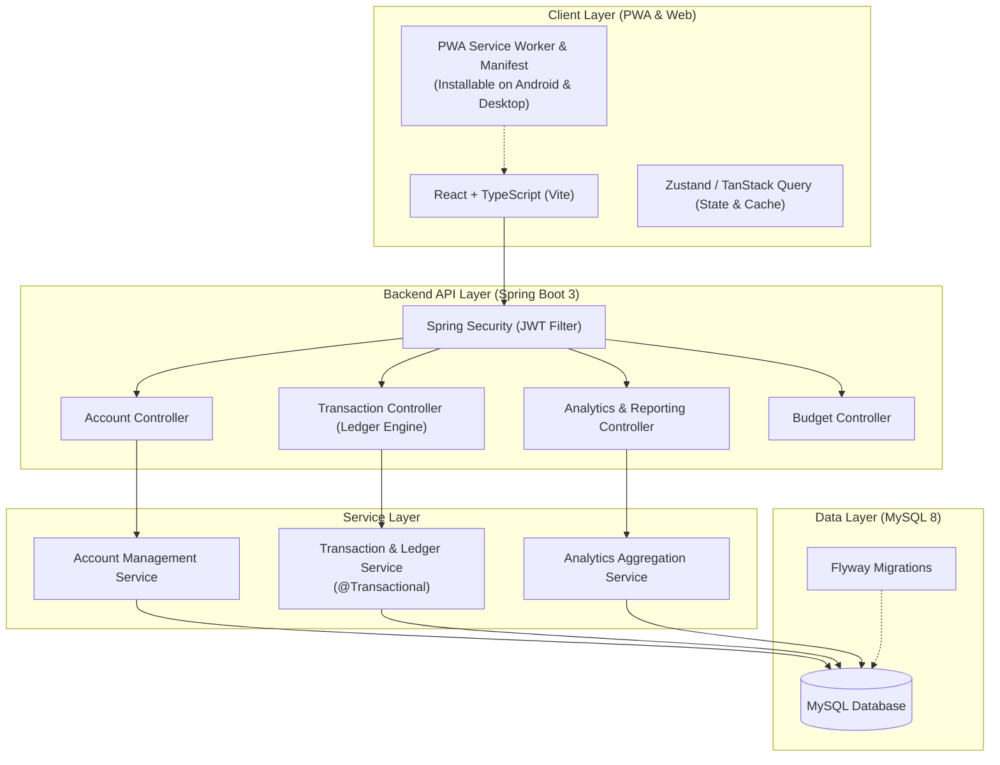
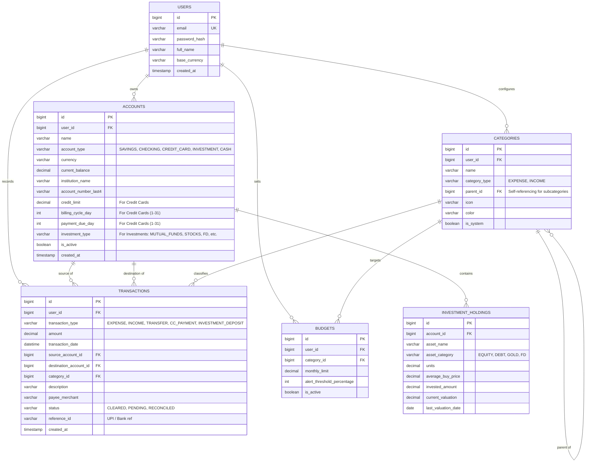

# Expense & Wealth Manager — System Architecture & Entity Plan

## 1. System Overview

The Expense Manager is a personal finance and wealth management system engineered with a **double-entry ledger foundation**. It models real-world multi-account banking, separate investment tracking, and credit card lifecycles without double-counting transfers or bill payments.

---

## 2. The Core Financial Ledger Model

In personal finance, treating all transactions as a simple `amount` field causes major accounting errors (such as credit card payments or transfers to savings showing up as expenses).

The table below defines how each transaction type behaves:

| Transaction Type | Source Account | Destination Account | Category | Impact on Net Worth | Counted as Expense? |
| :--- | :--- | :--- | :--- | :--- | :--- |
| **EXPENSE** (from Bank) | Bank Account ($-$) | *None* | Expense Category | Decreases Net Worth | **YES** |
| **EXPENSE** (from Card) | Credit Card ($+$ Debt) | *None* | Expense Category | Decreases Net Worth | **YES** |
| **INCOME** | *None* | Bank Account ($+$) | Income Category | Increases Net Worth | **NO** (Income) |
| **INTERNAL TRANSFER** | Bank Account A ($-$) | Bank Account B ($+$) | *None* | Zero impact | **NO** |
| **CREDIT CARD PAYMENT** | Bank Account ($-$) | Credit Card ($-$ Debt) | *None* | Zero impact | **NO** |
| **INVESTMENT DEPOSIT** | Bank Account ($-$) | Investment Account ($+$) | *None* | Zero impact (Asset shift) | **NO** |
| **INVESTMENT WITHDRAWAL**| Investment Account ($-$) | Bank Account ($+$) | *None* | Zero impact (Asset shift) | **NO** |

---

## 3. Entity-Relationship Diagram (ERD)

---

## 4. Entity Details & Schema Strategy

### A. `users`
* Supports single-user personal deployment initially, but built multi-tenant from day one so you can share or expand in the future without schema rewrites.
* Default currency (e.g., `INR`, `USD`).

### B. `accounts`
* Unifies all financial locations:
  1. **Bank Accounts** (`SAVINGS`, `CHECKING`): Balance represents positive liquid cash.
  2. **Credit Cards** (`CREDIT_CARD`): Balance represents outstanding debt/liability. Has `credit_limit`, `billing_cycle_day`, and `payment_due_day`.
     * *Available Credit* = `credit_limit - current_balance`.
     * *Utilization Rate* = `(current_balance / credit_limit) * 100`.
  3. **Investment Accounts** (`INVESTMENT`): Portfolio accounts holding assets (Mutual Funds, Demat, Fixed Deposits, EPF/PPF).
  4. **Physical Cash / Wallets** (`CASH`, `WALLET`).

### C. `categories`
* Two-level hierarchy via `parent_id` (e.g., Parent: `Food & Dining` $\rightarrow$ Children: `Groceries`, `Restaurants`, `Coffee`).
* Accompanied by UI icons (Lucide icon identifier) and color tags for charts.

### D. `transactions`
* The atomic unit of money movement.
* Enforces strict validation:
  * If `EXPENSE`: `source_account_id` and `category_id` are required.
  * If `INCOME`: `destination_account_id` and `category_id` are required.
  * If `TRANSFER` / `CREDIT_CARD_PAYMENT` / `INVESTMENT_DEPOSIT`: both `source_account_id` and `destination_account_id` are required; `category_id` is null.

### E. `investment_holdings`
* Allows tracking separate investment instruments inside each investment account (e.g. Parag Parikh Flexi Cap Fund inside Groww/Zerodha account).
* Tracks both **invested amount** and **current valuation**, letting you monitor unrealized gains/losses over time.

---

## 5. Analytics & Aggregation Engine

The application provides real-time metrics across 3 analytical time frames: **Weekly**, **Monthly**, and **Yearly**:

1. **Cash Flow Breakdown**:
   $$\text{Net Cash Flow} = \text{Total Income} - \text{Total Expenses}$$
2. **True Net Worth**:
   $$\text{Net Worth} = \sum (\text{Bank Assets} + \text{Investments} + \text{Cash}) - \sum (\text{Credit Card Outstandings})$$
3. **Savings & Investment Rate**:
   $$\text{Investment Rate} = \frac{\text{Invested Amount}}{\text{Total Income}} \times 100$$
4. **Credit Card Health**:
   * Outstanding statement balance vs unbilled balance.
   * Days remaining until due date.
   * Total credit utilization across all cards.
